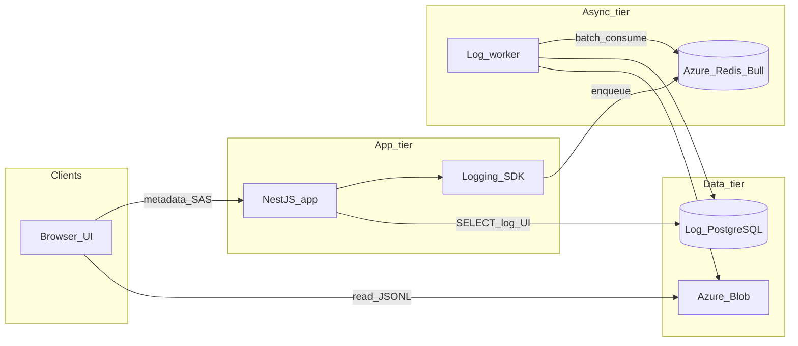

# Solution architecture: distributed logging platform (Umenu Tradigital)

This document is the solution-architecture plan derived from [requirement.md](requirement.md). It is the project copy of the planning artifact (queue, separate PostgreSQL, Azure Blob, NestJS SDK, log viewer UI).

**Overview:** A greenfield design for a non-blocking, sampled HTTP/external-api logging platform: NestJS SDK → Redis (Bull) → worker writing PostgreSQL metadata + Azure Blob JSONL/gzip batches, with a DevTools-style UI that loads metadata from the API and heavy payloads from Blob via short-lived SAS URLs.

**Delivery checklist (high level):**

- **Repo (implemented):** [packages/request-logging-sdk](../packages/request-logging-sdk) (Express in-process SDK + `requests` SQL); distributed worker/log-api apps may live in-repo or separately—see root [README.md](../README.md).
- Provision Azure Redis, PostgreSQL (log DB), Blob + lifecycle, Key Vault, API + worker compute
- Create `log_activity` schema, indexes, and batch retention DELETE job
- Implement Bull consumer: batch 100–500, bulk INSERT, gzip JSONL stream to Blob
- **Nest / Bull hot path:** implement in the host app (interceptor + Bull enqueue) per sections below; Express hosts can use [packages/request-logging-sdk](../packages/request-logging-sdk) instead.
- Expose log-activities API + SAS endpoint; build DevTools-style UI with chunk loading

### Alternative: in-process Express SDK (single Node process)

For **Express** hosts that want **one package** to own capture + optional Redis queue + PostgreSQL + optional Azure Blob **inside the same process** (no separate Bull worker), use **[packages/request-logging-sdk](../packages/request-logging-sdk)** with `initSDK()` + `captureMiddleware()`. It uses a `requests` table and per-request JSON blobs under `{projectId}/yyyy/mm/dd/{requestId}-*.json` (see [packages/request-logging-sdk/README.md](../packages/request-logging-sdk/README.md)). This path trades horizontal isolation for integration simplicity; the distributed Nest + worker design above remains the default for high-volume or strict hot-path isolation.

---

## 1. Requirements review (gaps and strengths)

**Strengths (clear and testable):** async-only persistence via Bull; separate PostgreSQL; Blob for heavy payloads; batching (queue, DB, Blob); path-based Blob partitioning; sampling rules; SAS for private Blob; UI routes and filter constraints.

**Gaps to resolve during implementation (not blockers for the plan):**

- **Header propagation:** Spec lists `x-trace-id` and `x-span-id` but also requires `parentSpanId`. Plan: add `x-parent-span-id` (or W3C `traceparent` if you standardize) so the worker can build a tree without guessing.
- **“Chunk” window:** UI loads 5–10 minute chunks; align API pagination with the Blob folder granularity (`{hh}/{mm}-{part}.json.gz`) and metadata `created_at` so “next chunk” queries stay consistent.
- **Identity model:** `userId` is assumed available in the app context; document how the SDK resolves it (e.g. from JWT, header, or async local storage).

---

## 2. Target context diagram

- **Request path is non-blocking:** SDK enqueues; no DB for the hot log write path. **No** `LOG_DB_*` in the SDK.
- **Read path (log viewer):** the **API** that serves `/log-activities` uses **§4.4** — **`SELECT` on the log PostgreSQL** (same instance as the worker, read-only or read-only user). The **SAS** for Blob is generated by a backend (often the same Nest app, different controller). The UI loads JSONL from Blob with SAS. See **§4.4** for which processes hold `LOG_DB_*`.
- **If log viewer and product API are different deployments,** split: only the log viewer service connects to `LOG_DB_*` for `SELECT`.

---

## 3. Infrastructure (recommended Azure layout)

| Layer | Service | Role |
|--------|---------|------|
| Cache / queue | **Azure Cache for Redis** | Bull broker; back-pressure for workers |
| Metadata | **Azure Database for PostgreSQL (Flexible Server)** | Dedicated *log* DB (not app DB) |
| Payloads | **Storage Account (Blob)** + **lifecycle management rules** | gzip JSONL batches; auto-delete after retention (align with 7–30d policy) |
| App + worker | **Container Apps** or **App Service** (two revisions/deployments) or **AKS** (if you already run K8s) | Process A: NestJS API; Process B: worker consumer |
| Secrets | **Key Vault** | Connection strings, storage keys (prefer managed identity + RBAC to Blob/Redis/Postgres where possible) |
| CI/CD | Your existing pipeline | Build NPM package, API image, worker image |

**Networking:** Private endpoints for Redis, PostgreSQL, and Storage where policy requires; allow Storage HTTPS egress from API for SAS generation; allow worker Blob write.

**Environments:** Mirror `env` in Blob paths and config (`dev`, `stg`, `prod`).

---

## 4. Database (PostgreSQL) — logical design

**Schema name:** e.g. `log` (optional).

### 4.1 Primary table: `log_activity` (or `log_entries`)

Store **one row per emitted log event** (or per *span* if you model spans as rows—start with one row per log line aligned with requirements JSON).

| Column | Type | Notes |
|--------|------|--------|
| `id` | `bigserial` | PK |
| `trace_id` | `text` / `uuid` | Indexed; join key for UI |
| `span_id` | `text` | |
| `parent_span_id` | `text` nullable | |
| `user_id` | `text` / `uuid` nullable | From app context |
| `service` | `text` | e.g. `umenu` (matches Blob `{service}`) |
| `env` | `text` | e.g. `prod` |
| `path` | `text` | HTTP path or logical route |
| `method` | `text` | HTTP method (nullable for non-HTTP events) |
| `status` | `int` nullable | HTTP or logical status |
| `duration_ms` | `int` nullable | |
| `event_type` | `text` | e.g. `http_request`, `http_response`, `external_api` |
| `created_at` | `timestamptz` | **Server time at ingest**; filter ≤15 days in UI |
| `payload_path` | `text` | Blob key to gzip JSONL **segment** (see §5) |
| `payload_offset` | `bigint` nullable | Optional: byte offset/line index inside JSONL for fine drill-down |
| `error_flag` | `boolean` | Denormalize for quick filters (100% sample on error) |
| `sampled` | `boolean` | Whether this row was from sampled traffic (audit) |
| `context` | `jsonb` nullable | **Optional.** Arbitrary key-value from SDK `contextEnrich` (minus columns already materialized) for list/detail without opening Blob; index only if you add queryable keys |

**Indexes (per spec + query patterns):**

- `(user_id, created_at DESC)` — user timeline
- `(created_at DESC)` — retention delete + time-range scans
- `(status)` — status filter
- `(trace_id, created_at)` — trace detail view
- Optional: `GIN` on `path` if heavy text search; otherwise B-tree on `path` only if exact match

### 4.2 Retention job

- Scheduled job (cron, Azure Function timer, or worker tick): `DELETE FROM log_activity WHERE created_at < now() - interval 'N days' LIMIT 1000` in a loop until 0 rows (as per spec). Tune `N` (7–30) per environment.

### 4.3 No synchronous logging

Application code **must not** insert into this DB; only the **worker** writes after batching from Redis.

### 4.4 Who opens the database connection (log PostgreSQL)

| Component | Connects to log PostgreSQL? | Role |
|-----------|-----------------------------|------|
| **Bull worker** (log consumer) | **Yes (write + bulk insert).** | Uses `LOG_DB_HOST`, `LOG_DB_PORT`, `LOG_DB_USER`, `LOG_DB_PASS`, `LOG_DB_NAME` (or a single `DATABASE_URL` / Key Vault–backed URL). This is the **only** process that may **INSERT** metadata rows. |
| **Log viewer backend API** (the service that implements `GET /log-activities` and trace detail) | **Yes (read, typically).** | Same **logical** database as the worker; **read-only** user or read-only role for defense in depth. It runs **SELECT** to power filters, pagination, and `traceId` views. *Optionally* colocate in the same Nest app as the main product with a second TypeORM/Prisma datasource named e.g. `logDb`—or deploy a **separate** small API. |
| **Main Nest app + logging SDK** | **No** | Only talks to **Redis** (Bull). **Does not** use `LOG_DB_*`. |
| **Retention job** | **Yes (write DELETE).** | Can run in the same process as the worker, a **scheduled Nest task**, or **pg_cron** / Azure Function. Needs **delete** on `log_activity` (same DB as worker; often the **same** DB user as the worker or a dedicated “maintenance” user). |
| **Browser / UI** | **No** | Never connects to PostgreSQL. |

**Summary:** the **`LOG_DB_*` connection string in configuration applies to the worker and to any service that must query log metadata (viewer API) or run retention;** it does **not** apply to the SDK-integrated application process unless that same process also hosts the log viewer API and registers a second data source. Keep credentials in **Key Vault** or secret store; use **private link** to Azure Database for PostgreSQL where required.

---

## 5. Blob model (heavy payloads)

- **Object key pattern (from spec):**  
  `logs/{service}/{env}/{yyyy}/{mm}/{dd}/{hh}/{mm}-{part}.json.gz`
- **Content:** **JSONL**, gzip-compressed; each line = one log payload object (request snapshot, error body, external API call record), including at minimum `traceId`, `spanId`, timestamps, and truncated/masked bodies.
- **Batching rules:** worker accumulates in-memory/rolling buffers; flush every **5–10 min** or **> 5MB**; **no append** to old objects—**new object per flush**; **no one-object-per-log** at tiny scale (many lines per object).
- **Linking to PG:** `payload_path` points to the blob name; if multiple log lines share one file, use `payload_offset` or a **line index** field to locate the row (or embed a monotonous `logLineId` in JSONL and store it in PG).

### 5.1 Who uses Azure Blob credentials (connection / signing)

| Component | Uses storage account? | Role |
|-----------|------------------------|------|
| **Bull worker** | **Yes (write).** | `@azure/storage-blob` upload to `BLOB_CONTAINER`; path pattern §5. Auth: connection string, storage key, or managed identity (Key Vault). |
| **Log viewer API** (SAS route) | **Yes (sign SAS only).** | Same account + container scope; generates short-lived **read** SAS for `payload_path` rows. No blob I/O in the **SDK** or for every list query. |
| **Host app hot path** (Nest or other) | **No** to log DB/Blob | Enqueue to Redis/Bull only when using distributed SDK pattern. |
| **Browser** | **No account secret** | Reads blob URL with SAS query string. |

`BLOB_ACCOUNT` and `BLOB_CONTAINER` in config identify the **resource**; the **credential** to construct `BlobServiceClient` is an implementation detail (see [packages/request-logging-sdk/src/blob/azure-blob.ts](../packages/request-logging-sdk/src/blob/azure-blob.ts) for a minimal upload helper pattern).

---

## 6. Queue and worker behavior

- **Bull queue name:** e.g. `log-events`.
- **Job payload (conceptual):** array of `LogEvent` (see entities below) up to **100–500** items per job (or one job with batched array—implementation detail).
- **Retries:** 3 attempts with exponential backoff; dead-letter or poison queue for inspection if still failing.
- **Worker steps:** (1) optional mini-batch in Redis, (2) **bulk insert** metadata to PostgreSQL, (3) **stream** gzip JSONL to Blob (no full payload held longer than the streaming window).

---

## 7. Entities (domain / DTOs)

Use these as stable contracts between **SDK → queue → worker → storage → API → UI**.

### 7.1 `LogEvent` (queue + Blob line)

- `traceId`, `spanId`, `parentSpanId?`
- `userId?`
- `service`, `env`
- `eventType`: `http_request` | `http_response` | `external_api` | `custom`
- `method?`, `path?`, `status?`, `durationMs?`
- `requestBodyTruncated?`, `requestMasked?` (flags)
- `responseOnError?` (only if status not 2xx, per spec)
- `externalApi`: `{ url, method, status, durationMs, errorPayload? }`
- `createdAt` (client or server; worker may normalize to ingest time for DB)
- `sampling`: `{ decision: 'kept' | 'dropped' }` — only *kept* events are enqueued
- `context?`: `Record<string, unknown>` — optional **custom fields** from `contextEnrich(req)` in the SDK (e.g. `userId`, `tenantId`). Maps known keys to metadata columns; remainder stored in JSONL and optionally in a `context` **jsonb** column if you add it for API filtering

### 7.2 `LogMetadata` (DB row / API list item)

- Subset of `LogEvent` + `id`, `payloadPath`, `createdAt` (ingest), `errorFlag`, `sampled`

### 7.3 `SasRequest` / `SasResponse` (API)

- Request: `blobPath` or `traceId` + time window (server resolves allowed paths)
- Response: `sasUrl`, `expiresAt`

### 7.4 UI view models

- **TimelineModel:** ordered spans by `trace_id` (from API list + detail)
- **DetailModel:** line from JSONL after fetch, matched by `traceId` / line id

---

## 8. Host HTTP instrumentation (Nest or other) — reference behaviour

This repo **does not ship** a separate Nest npm package. Implement the following in your Nest (or other) host when using the **distributed** pattern:

- **Middleware:** assign or forward `x-trace-id` / `x-span-id` / `x-parent-span-id` early; **one `traceId` per request** for all related log lines.
- **Interceptor:** if logging disabled, no-op; else path exclusion (optional regex), **sampling** (errors and slow requests always kept), optional `contextEnrich` for `userId` / tenant fields; measure **duration** and **status** on the HTTP response **`finish`** event (not only Observable `finalize`).
- **Enqueue:** call **Bull `add()`** (or equivalent) only — **never** `INSERT` to PostgreSQL or Blob on the request thread.

For **Express** hosts, use [packages/request-logging-sdk](../packages/request-logging-sdk) (`initSDK` + `captureMiddleware`) which follows the same non-blocking rules in-process.

---

## 9. Backend API (for UI) — capabilities

- `GET /log-activities` — filters: `userId`, `from`, `to` (max span 15 days), `method`, `status`; cursor pagination; returns metadata rows
- `GET /log-activities/:traceId` — all rows for a trace (timeline)
- `POST` (or `GET`) **SAS issuance** — validates user scope, returns short-lived read SAS for specific `payload_path`(s) or for a time-aligned prefix (follow least-privilege: prefer exact paths from PG rows)

**Authorization:** map app roles so QA/dev see only allowed tenants/users if applicable.

---

## 10. UI (DevTools-style)

- **Routes** as in [requirement.md](requirement.md): list, detail, query string filters
- **Layout:** 2/3 timeline / trace map, 1/3 detail pane
- **Data:** metadata from API; on row expand, request SAS and **fetch** gzip JSONL (or pre-signed range if you add range reads later)
- **Client-side filter:** on fetched JSONL for the open window; respect “5–10 minute chunk” loading to limit memory

---

## 11. Security checklist

- Private Blob; **user delegation SAS** or account SAS scoped to `logs/...` prefix + read-only + short expiry (1–5 min)
- No sensitive data in PG without need; PII in Blob only masked
- Service-to-service: managed identity to Storage/Redis/DB where possible

---

## 12. Suggested delivery phases (repo is greenfield)

1. **Infra:** Azure Redis, PostgreSQL (log DB), Storage account + lifecycle, Key Vault, two deployables (API + worker).
2. **Worker + schema:** table + migrations; Bull consumer; JSONL gzip upload + PG bulk insert.
3. **Host SDK / instrumentation:** trace headers, sampling, mask/truncate, enqueue only (Nest: implement per §8; Express: [packages/request-logging-sdk](../packages/request-logging-sdk)).
4. **NestJS integration** in the real app: wire module, env vars from spec (`LOG_DB_*` may apply to log DB in worker, not in API if API is metadata-only).
5. **UI:** routes, timeline, SAS fetch, in-memory filter.
6. **Retention + load tests** validate non-blocking and batch sizes.

---

## 13. Open decisions (product/engineering)

- **W3C Trace Context** vs custom headers: adopting `traceparent` improves interoperability; spec can be extended.
- **One DB row per request vs per span:** start with one row per *logical log event* (request + external calls may be multiple rows sharing `trace_id`).
- **Monorepo layout:** e.g. `packages/request-logging-sdk`, `apps/api`, `apps/log-worker`, `apps/log-ui`—choose when the codebase is initialized.

This plan is fully driven by [requirement.md](requirement.md); once the repository contains real services, revisit naming (`LOG_DB_*` used by worker vs API) and align `service` / `env` with deployment metadata.
